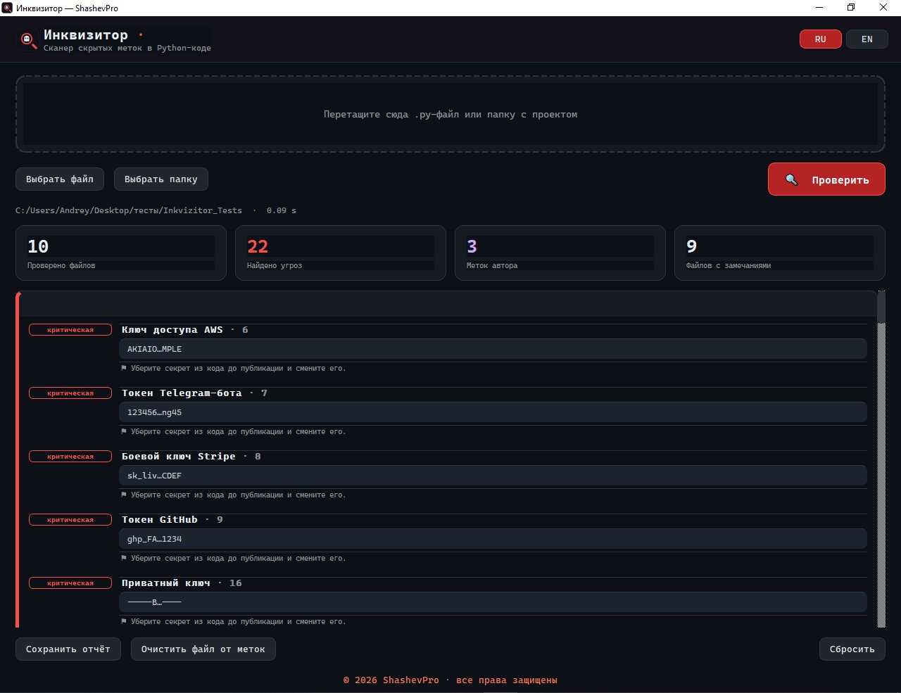
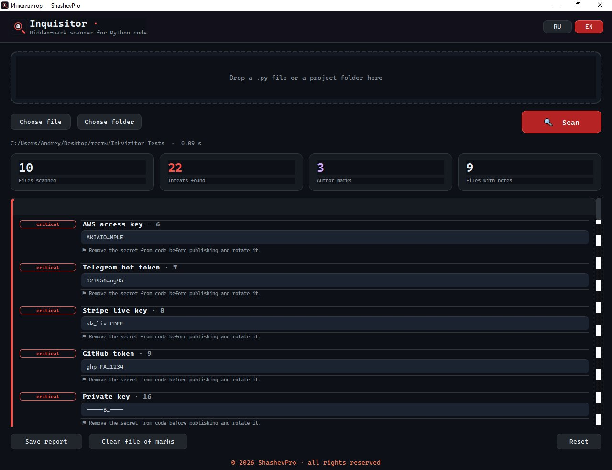

<h1 align="center">🔍 Инквизитор · Inquisitor</h1>

<p align="center">
  <b>Сканер скрытых меток и угроз в Python-коде</b><br>
  <b>Desktop scanner for hidden marks and threats in Python code</b>
</p>

<p align="center">
  <a href="#-русский">🇷🇺 Русский</a> ·
  <a href="#-english">🇬🇧 English</a> ·
   ·
   ·
  
</p>

---

## 🇷🇺 Русский

**Инквизитор** — настольная программа, которая проверяет Python-код на то, что не видно
глазами: невидимые символы Юникода, стеганографические вставки, поддельные «похожие»
буквы, зашитые секреты и обфусцированный/опасный код. Удобно перед тем, как запускать или
публиковать чужой код.

<p align="center">
  
</p>

### Что находит

- **Невидимые символы Юникода** — zero-width, управление направлением текста
  (bidi / Trojan Source, U+202E), tag-символы (ASCII-контрабанда), селекторы начертания.
- **Стеганография** — расшифровывает скрытые сообщения в невидимых символах несколькими
  схемами; распознаёт метки автора.
- **Гомоглифы** — слова со смешанными алфавитами (например, латиница + кириллическая «а»).
- **Секреты** — ключи AWS, токены Telegram, Stripe, GitHub, Google, Slack, приватные
  ключи, JWT и обобщённые присваивания паролей/токенов.
- **Закодированные строки** — длинные base64/hex.
- **Водяные знаки** — `__author__`, копирайты, метки в комментариях.
- **Опасный код** — `exec`/`eval`/`compile`, сетевые вызовы, запуск системных команд
  (анализ дерева разбора, AST).

### Особенности

- Отчёт-«светофор»: 🟢 чисто · 🟡 замечания · 🔴 угрозы.
- Экспорт отчёта в HTML и текст; очистка файла от невидимых меток.
- Тёмная тема, перетаскивание файла/папки, переключение **RU/EN**.
- **Движок без зависимостей** (только стандартная библиотека) — работает и в консоли.
  Графический интерфейс — на PyQt6.

### Статья на Medium

📖 [I Built a Desktop Scanner That Detects Hidden Threats in Python Code](https://medium.com/@andryhasayan/b50815fbe2f1)

### Установка и запуск

```bash
git clone https://github.com/andryhasayan-source/inkvizitor.git
cd inkvizitor
pip install -r requirements.txt
python main.py
```

Проверка одного файла из консоли (код возврата `0` — чисто, `1` — есть угрозы):

```bash
python main.py путь/к/файлу.py
```

### Сборка .exe (Windows)

```bat
build.bat
```

Готовый файл появится в `dist\Inkvizitor.exe`. Зависимости (PyQt6, PyInstaller) ставятся
автоматически.

### Формат метки автора

```
SHASH|shashevpro.ru|2026-06-18|FD845584
└─┬─┘ └─────┬─────┘ └────┬───┘ └──┬───┘
магия    домен        дата      CRC32
```

Инквизитор **обнаруживает** такие метки (своя метка — «инфо», чужая — «средняя»). Само
создание меток выполняется отдельным инструментом.

### Лицензия и автор

MIT © 2026 **ShashevPro** · [shashevpro.ru](https://www.shashevpro.ru/) ·
[vk.com/andrey_shashev](https://vk.com/andrey_shashev)

---

## 🇬🇧 English

**Inquisitor** is a desktop tool that scans Python code for what the eye cannot see:
invisible Unicode characters, steganographic payloads, look-alike (homoglyph) letters,
hard-coded secrets, and obfuscated or dangerous code. Handy before you run or publish
someone else's code.

<p align="center">
  
</p>

### What it detects

- **Invisible Unicode** — zero-width characters, bidirectional override
  (Trojan Source, U+202E), tag characters (ASCII smuggling), variation selectors.
- **Steganography** — decodes hidden messages embedded in invisible characters using
  several schemes; recognizes author marks.
- **Homoglyphs** — mixed-script words (e.g. Latin with a Cyrillic "а").
- **Secrets** — AWS keys, Telegram / Stripe / GitHub / Google / Slack tokens, private
  keys, JWTs and generic password/token assignments.
- **Encoded strings** — long base64 / hex literals.
- **Watermarks** — `__author__`, copyrights, marks in comments.
- **Dangerous code** — `exec`/`eval`/`compile`, network calls, shell commands
  (AST analysis).

### Highlights

- Traffic-light report: 🟢 clean · 🟡 notes · 🔴 threats.
- Export the report to HTML and text; clean a file of invisible marks.
- Dark theme, drag-and-drop a file/folder, **RU/EN** switch.
- **Dependency-free engine** (standard library only) — runs headless too. The GUI uses
  PyQt6.

### Medium Article

📖 [I Built a Desktop Scanner That Detects Hidden Threats in Python Code](https://medium.com/@andryhasayan/b50815fbe2f1)

### Install & run

```bash
git clone https://github.com/andryhasayan-source/inkvizitor.git
cd inkvizitor
pip install -r requirements.txt
python main.py
```

Scan a single file from the console (exit code `0` = clean, `1` = threats found):

```bash
python main.py path/to/file.py
```

### Build the .exe (Windows)

```bat
build.bat
```

The result appears at `dist\Inkvizitor.exe`. Dependencies (PyQt6, PyInstaller) are
installed automatically.

### Author mark format

```
SHASH|shashevpro.ru|2026-06-18|FD845584
```

Inquisitor only **detects** such marks (own mark → "info", foreign → "medium"). Creating
marks is done by a separate tool.

### License & author

MIT © 2026 **ShashevPro** · [shashevpro.ru](https://www.shashevpro.ru/) ·
[vk.com/shashevpro](https://vk.com/shashevpro)
